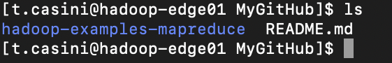
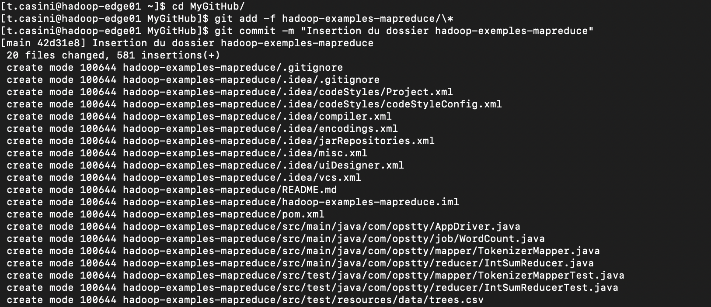

# Timothée CASINI - BigData Frameworks - DS6
TP4 - Yarn&MapReduce 2 - Git Hub Respository

### Initialisation du dépôt **GitHub** :

- On commence par créer un respository (public) et on le nomme : 
  * `t.casini_hadoop-exemples`

- Ensuite on clone le dépôt contenant le dossier *hadoop-exemples-mapreduce* dans l'environnement **Hadoop** :
  * `git clone https://github.com/makayel/hadoop-examples-mapreduce.git`

- On clone maintenant notre **dépôt GitHub personnel** dans le dossier *MyGitHub* :
  * `git clone https://github.com/Gratouille123/t.casini_hadoop-exemples.git ./MyGitHub`

- On copie le dosssier *hadoop-exemples-mapreduce* dans le dosssier *MyGitHub* afin de pouvoir le transferer au dépôt **GitHub** :
  * `cp -R hadoop-examples-mapreduce ./MyGitHub`

- On ajoute le dossier *hadoop-exemples-mapreduce* au dépôt **GitHub** :
  * `git add -f hadoop-examples-mapreduce/\*`

- On génère un **token d'accès** depuis le **GitHub** afin de pouvoir pousser les donner vers le dépôt personnel :
  * `TOKEN = Ghp_wSKqEiOAfwMres8lmiRk40qiASb8ID3hl4F2`
  * 

